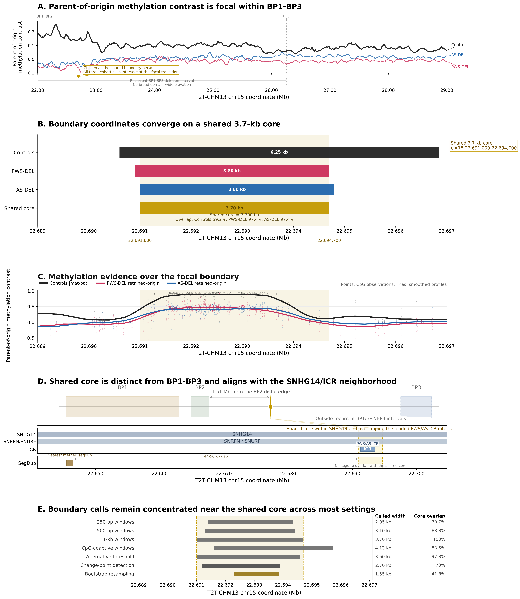

# Figure 3 improved quantitative report

## Executive summary

- Shared focal interval: `chr15:22,691,000-22,694,700` (3.70 kb; midpoint `22,692,850`)
- Entry-coordinate spread across Controls, PWS-DEL, and AS-DEL: `400 bp`
- Exit-coordinate spread across Controls, PWS-DEL, and AS-DEL: `2,150 bp`
- Control signal definition in panel C: `|maternal - paternal|` (`absolute` mode)
- Shared core fraction of cohort intervals: Controls `59.2%`, PWS-DEL `97.4%`, AS-DEL `97.4%`

## Panel A: locus-wide context and why this boundary was chosen

- The shared core spans `22,691,000-22,694,700` and is only `0.053%` of the full 7-Mb locus-wide overview, so Panel A marks it as a boundary line/pin rather than as a broad band.
- BP1, BP2, and BP3 intervals loaded for the figure lie at `17,691,439-20,454,275`, `20,753,698-21,183,655`, and `25,875,912-26,632,507` respectively.
- The shared midpoint is `1,509,195` bp distal to BP2 and `3,183,062` bp proximal to BP3.
- This site is carried forward as the shared boundary because it is the exact intersection of the three primary intervals: Controls `22,690,600-22,696,850`, PWS-DEL `22,690,900-22,694,700`, and AS-DEL `22,691,000-22,694,800`.
- Panel A is intentionally limited to locus-wide context; the fine-scale methylation transition used to support the call is shown in Panel C.
- The shared interval overlaps genes: SNHG14, SNRPN, SNURF.
- Overlapping ICR annotations: ICR_893*^ (22,691,258-22,693,494).

## Panel B: interval convergence

| Interval | Coordinates | Width (bp) | Width (kb) | Shared core fraction |
| --- | --- | --- | --- | --- |
| Controls | chr15:22,690,600-22,696,850 | 6,250 | 6.25 | 59.2% |
| PWS-DEL | chr15:22,690,900-22,694,700 | 3,800 | 3.80 | 97.4% |
| AS-DEL | chr15:22,691,000-22,694,800 | 3,800 | 3.80 | 97.4% |
| Shared core | chr15:22,691,000-22,694,700 | 3,700 | 3.70 | 100% |

Boundary-edge shifts:

| Comparison | Entry shift (bp) | Exit shift (bp) |
| --- | --- | --- |
| PWS-DEL vs Controls | +300 | -2150 |
| AS-DEL vs Controls | +400 | -2050 |
| AS-DEL vs PWS-DEL | +100 | +100 |

Pairwise overlap summary:

| Comparison | Overlap (bp) | Overlap (kb) | Fraction of first interval | Fraction of second interval | Jaccard |
| --- | --- | --- | --- | --- | --- |
| Controls ∩ PWS-DEL | 3,800 | 3.80 | 60.8% | 100% | 0.608 |
| Controls ∩ AS-DEL | 3,800 | 3.80 | 60.8% | 100% | 0.608 |
| PWS-DEL ∩ AS-DEL | 3,700 | 3.70 | 97.4% | 97.4% | 0.949 |
| Controls ∩ PWS-DEL ∩ AS-DEL | 3,700 | 3.70 | 59.2% | 97.4% |  |

## Panel C: methylation evidence

- Panel C displays both smoothed cohort profiles and raw single-CpG observations across `chr15:22,689,000-22,697,000`.
- The shared interval spans the loaded ICR from `22,691,258` to `22,693,494`, extending `258` bp upstream and `1,206` bp downstream of that ICR.

| Cohort | CpGs in panel C | CpGs in shared core | Signal range |
| --- | --- | --- | --- |
| Controls | 654 | 510 | 0.00 to 0.95 |
| PWS-DEL | 1,522 | 1,202 | -0.56 to 0.92 |
| AS-DEL | 974 | 758 | -0.41 to 0.72 |

Primary boundary annotation summary:

| Boundary source | Boundary type | Coordinate | Nearest gene | Nearest ICR | Distance to ICR (bp) |
| --- | --- | --- | --- | --- | --- |
| Control | entry | 22,690,600 | SNHG14 | ICR_893*^ | 658 |
| Control | exit | 22,696,850 | SNHG14 | ICR_893*^ | 3,356 |
| PWS_DEL | entry | 22,690,900 | SNHG14 | ICR_893*^ | 358 |
| PWS_DEL | exit | 22,694,700 | SNHG14 | ICR_893*^ | 1,206 |
| AS_DEL | entry | 22,691,000 | SNHG14 | ICR_893*^ | 258 |
| AS_DEL | exit | 22,694,800 | SNHG14 | ICR_893*^ | 1,306 |

## Panel D: structural and regulatory context

- Shared core lies within SNHG14/SNRPN/SNURF; overlaps ICR_893*^ at chr15:22,691,258-22,693,494. No overlap with BP-hotspot proxies or segmental duplications. Nearest BP proxy: BP2, 1.51 Mb away; nearest segdup: 44-50 kb away. Supports an imprinting-centre-associated regulatory feature rather than deletion architecture.

Breakpoint distance table:

| Breakpoint | Start | End | Midpoint | Distance to shared start (bp) | Distance to shared midpoint (bp) | Distance to shared end (bp) |
| --- | --- | --- | --- | --- | --- | --- |
| BP1 | 17,691,439 | 20,454,275 | 19,072,857 | 2,236,725 | 2,238,575 | 2,240,425 |
| BP2 | 20,753,698 | 21,183,655 | 20,968,676 | 1,507,345 | 1,509,195 | 1,511,045 |
| BP3 | 25,875,912 | 26,632,507 | 26,254,210 | 3,184,912 | 3,183,062 | 3,181,212 |

## Panel E: robustness and sensitivity

| Method | Called interval | Width (bp) | Width (kb) | Shared-core overlap (bp) | Shared-core overlap (%) | Called-interval overlap (%) | Status |
| --- | --- | --- | --- | --- | --- | --- | --- |
| 250-bp windows | chr15:22,691,400-22,694,350 | 2,950 | 2.95 | 2,950 | 79.7% | 100% | partial overlap |
| 500-bp windows | chr15:22,691,300-22,694,400 | 3,100 | 3.10 | 3,100 | 83.8% | 100% | partial overlap |
| 1-kb windows | chr15:22,691,000-22,694,700 | 3,700 | 3.70 | 3,700 | 100% | 100% | matches shared core |
| CpG-adaptive windows | chr15:22,691,609-22,695,739 | 4,130 | 4.13 | 3,091 | 83.5% | 74.8% | partial overlap |
| Alternative threshold | chr15:22,691,000-22,694,600 | 3,600 | 3.60 | 3,600 | 97.3% | 100% | partial overlap |
| Change-point detection | chr15:22,691,200-22,693,900 | 2,700 | 2.70 | 2,700 | 73% | 100% | partial overlap |
| Bootstrap resampling | chr15:22,692,300-22,693,848 | 1,548 | 1.55 | 1,548 | 41.8% | 100% | partial overlap |

Change-point support:

| Cohort | Entry change point | Exit change point | Entry shift vs shared start (bp) | Exit shift vs shared end (bp) | Method |
| --- | --- | --- | --- | --- | --- |
| Control | 22,691,200 | 22,693,900 | 200 | -800 | rolling-mean derivative maxima/minima |
| PWS_DEL | 22,691,200 | 22,694,000 | 200 | -700 | rolling-mean derivative maxima/minima |
| AS_DEL | 22,691,100 | 22,694,300 | 100 | -400 | rolling-mean derivative maxima/minima |
| Consensus | 22,691,200 | 22,693,900 | 200 | -800 | latest entry / earliest exit across cohort-specific derivative change points |

Bootstrap support:

- Replicates completed: `100` / `100`
- Median bootstrap start: `22,691,100` (95% CI `22,690,900` to `22,692,300`)
- Median bootstrap end: `22,694,700` (95% CI `22,693,848` to `22,694,800`)
- Supported bootstrap interval: `chr15:22,692,300-22,693,848`
- Limitation: Control sample size is n=2, so the bootstrap is CpG-resampling rather than sample-resampling.

Secondary/alternative boundary calls considered during convergence triage:

| Cohort | Segment | Entry boundary | Exit boundary | Entry shift vs control (bp) | Exit shift vs control (bp) | Status |
| --- | --- | --- | --- | --- | --- | --- |
| AS_DEL | 1 | 22,691,000 | 22,694,800 | 400 | -2,050 | convergent |
| AS_DEL | 2 | 22,692,200 | 22,694,800 | 1,600 | -2,050 | convergent |
| PWS_DEL | 1 | 22,509,000 | 22,511,300 | -181,600 | -185,550 | flag |
| PWS_DEL | 2 | 22,690,900 | 22,694,700 | 300 | -2,150 | convergent |
| PWS_DEL | 3 | 24,696,400 | 24,697,900 | 2,005,800 | 2,001,050 | flag |

## Interpretation

The quantitative pattern is consistent with a focal methylation-transition interval rather than a deletion-wide domain effect. The strongest coordinate agreement is the exact `3.70 kb` shared core, while alternative calling schemes remain centered on that interval even when their widths contract to `1.55 kb` or expand to `4.13 kb`.
